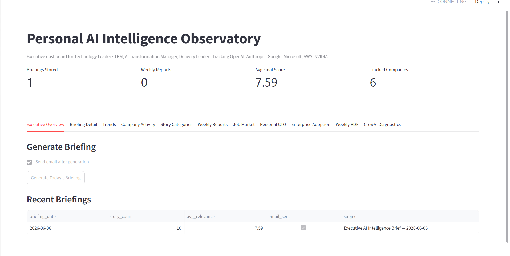
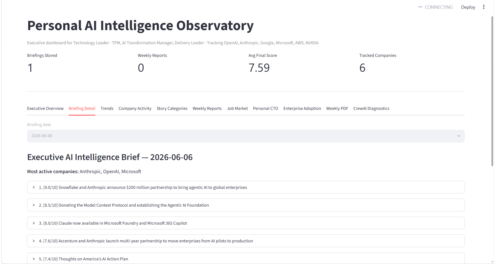
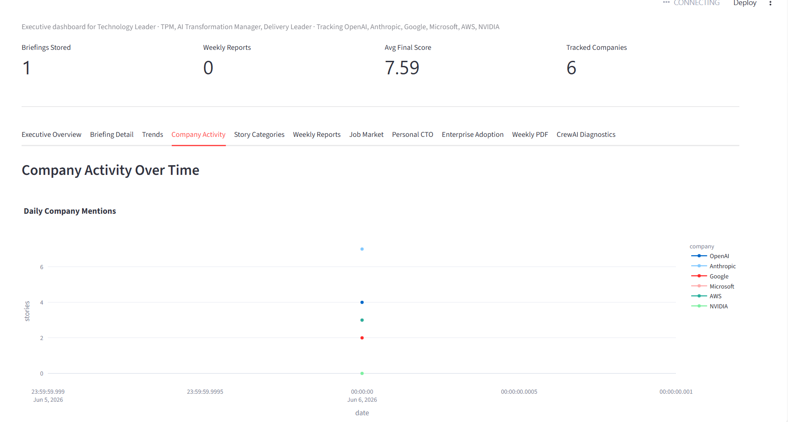
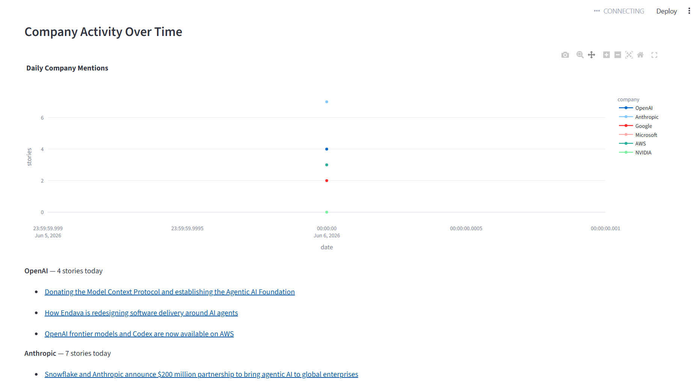
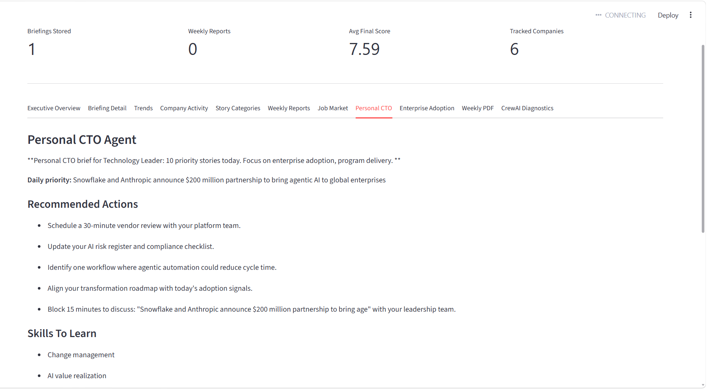
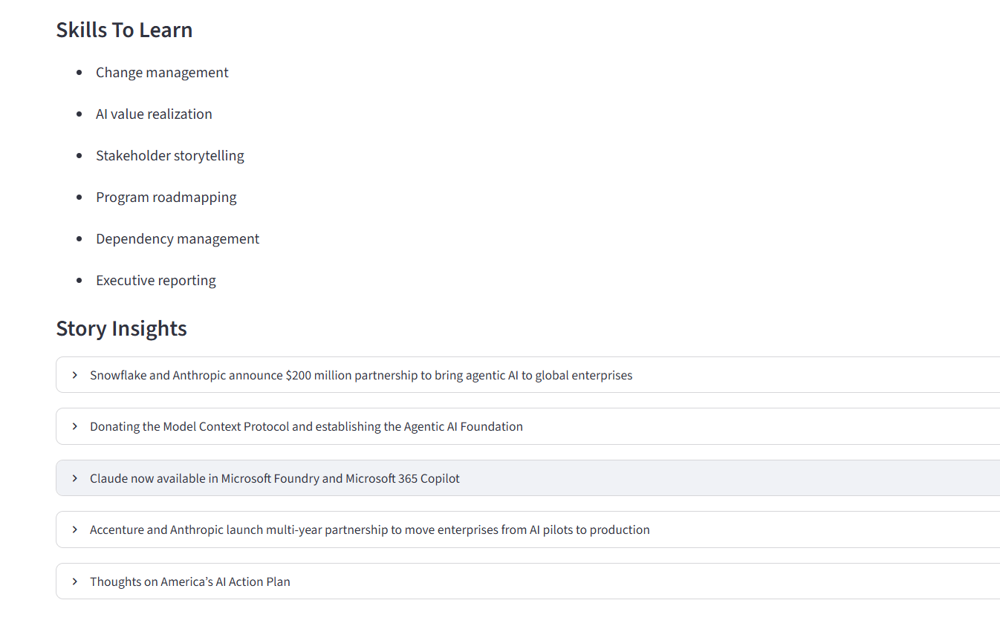
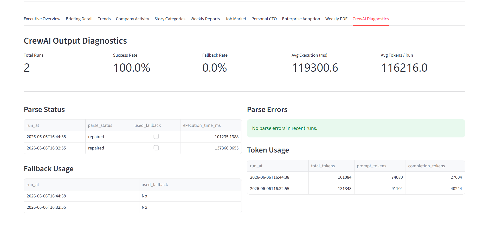

# AI Intelligence Observatory

An agentic AI intelligence platform that monitors the global AI ecosystem, tracks enterprise adoption, analyzes career impact, and delivers executive-ready daily briefings for technology leaders.

[](https://github.com/avadhshiva/ai-intelligence-observatory/actions/workflows/tests.yml)

## Overview

AI Intelligence Observatory collects AI news from RSS feeds and NewsAPI, scores stories for enterprise relevance, enriches them with personal and company intelligence, and produces a daily executive briefing. Output is delivered via email and visualized in a Streamlit dashboard.

Designed for TPMs, AI Transformation Managers, Delivery Leaders, and CIOs who need a concise, actionable view of the AI landscape.

## Architecture

```
News (RSS + NewsAPI)
        │
        ▼
   NewsCollector
        │
        ├── USE_LLM=false ──► Deterministic analysis pipeline
        │
        └── USE_LLM=true  ──► CrewAI agents (Scout → Analyst → Executive → Email)
                                    │
                                    ▼
                              JSON repair + Pydantic validation
                                    │
                          ┌─────────┴─────────┐
                          ▼                   ▼
                    Parse success      Deterministic fallback
                          │                   │
                          └─────────┬─────────┘
                                    ▼
                         Intelligence enrichment
                    (personal, company, career, job market,
                     enterprise adoption, personal CTO)
                                    │
                                    ▼
                    SQLite ──► Email ──► Streamlit Dashboard
```

## Features

- **Multi-source news collection** — OpenAI, Anthropic, Google, Microsoft, AWS, NVIDIA, Reuters, TechCrunch RSS + NewsAPI
- **CrewAI agent pipeline** — Scout, Analyst, Executive, and Email agents with parse repair and fallback
- **Personal intelligence** — Profile-driven relevance scoring from `config/user_profile.json`
- **Company tracking** — Activity scorecards for six major AI vendors
- **Career impact analysis** — Role-specific impact summaries
- **Job market signals** — Role demand and emerging skills detection
- **Enterprise adoption tracker** — Banking, retail, healthcare, logistics, e-commerce signals
- **Personal CTO brief** — Daily priority, actions, and skills to learn
- **Email delivery** — Responsive HTML briefings via Gmail SMTP
- **Executive dashboard** — Trends, categories, weekly reports, PDF export
- **CrewAI diagnostics** — Parse status, fallback rate, token usage, raw output viewer
- **Automated daily runs** — GitHub Actions cron at 06:00 IST

## Screenshots

### Executive Dashboard


### Briefing Detail


### Company Activity Analytics


### Company Activity Details


### Personal CTO Insights


### Personal CTO Details


### CrewAI Diagnostics


## Quick Start

```powershell
git clone https://github.com/avadhshiva/ai-intelligence-observatory.git
cd ai-intelligence-observatory

python -m venv .venv
.\.venv\Scripts\Activate.ps1
pip install -r requirements-dev.txt
pip install -e .

copy .env.example .env
copy config\user_profile.example.json config\user_profile.json

python scripts/health_check.py
python -m ai_observatory run --email
streamlit run dashboard/app.py
```

## Configuration

Copy `.env.example` to `.env` and set:

| Variable | Purpose |
|----------|---------|
| `OPENAI_API_KEY` | CrewAI / OpenAI reasoning |
| `NEWSAPI_KEY` | Supplemental news collection |
| `SMTP_*` / `EMAIL_*` | Email delivery |
| `USE_LLM` | `true` for CrewAI, `false` for deterministic mode |

Personalize intelligence scoring in `config/user_profile.json` (copy from `user_profile.example.json`).

See [docs/deployment.md](docs/deployment.md) for the full variable reference.

## Running Daily Briefings

### Local

```powershell
python -m ai_observatory run --email
```

### Scheduled (local)

```powershell
python -m ai_observatory schedule
```

### GitHub Actions

The `daily-briefing.yml` workflow runs at **06:00 IST** (00:30 UTC) every day. Configure GitHub Secrets (see below) and enable Actions.

Manual trigger: **Actions → Daily Briefing → Run workflow**.

## GitHub Actions Automation

| Workflow | Trigger | Purpose |
|----------|---------|---------|
| `tests.yml` | push, pull_request | pytest + health check |
| `daily-briefing.yml` | cron + manual | Generate and email daily briefing |

### Required GitHub Secrets

- `OPENAI_API_KEY`
- `NEWSAPI_KEY`
- `SMTP_HOST`
- `SMTP_PORT`
- `SMTP_USER`
- `SMTP_PASSWORD`
- `EMAIL_FROM`
- `EMAIL_RECIPIENTS`

## Dashboard Features

| Tab | Description |
|-----|-------------|
| Executive Overview | Generate briefings, view recent runs |
| Briefing Detail | Story-level scores, career impact, HTML preview |
| Trends | Story count and score over time |
| Company Activity | Vendor mention trends |
| Story Categories | Category evolution charts |
| Weekly Reports | Theme analysis and rising trends |
| Job Market | Role demand and emerging skills |
| Personal CTO | Daily priority and recommended actions |
| Enterprise Adoption | Industry adoption signals |
| Weekly PDF | Executive PDF report download |
| CrewAI Diagnostics | Parse status, fallback rate, token usage |

## CrewAI Diagnostics

When `USE_LLM=true`, every CrewAI run is captured in:

- `logs/raw_crewai_output.json` — raw output with repair steps
- SQLite `crew_parse_runs` table — metrics for the dashboard
- Dashboard **CrewAI Diagnostics** tab — success rate, errors, token usage

On parse failure, the pipeline logs the explicit reason and falls back to deterministic analysis so briefings always complete.

## Project Structure

```
ai-intelligence-observatory/
├── .github/workflows/       # CI and daily briefing automation
├── config/                  # User profile (example committed, local gitignored)
├── dashboard/app.py         # Streamlit executive dashboard
├── docs/                    # Deployment, audit, and release docs
├── scripts/                 # health_check.py, audit scripts
├── src/ai_observatory/
│   ├── agents/              # Intelligence enrichment agents
│   ├── collectors/          # RSS + NewsAPI collection
│   ├── reports/             # PDF generation
│   ├── schemas/             # Pydantic CrewAI output schemas
│   ├── crew.py              # CrewAI orchestration
│   ├── crew_parser.py       # JSON repair + validation
│   └── database.py          # SQLite persistence
├── tests/                   # pytest suite
├── requirements.txt         # Runtime dependencies
├── requirements-dev.txt     # Development dependencies
└── pyproject.toml           # Package metadata
```

## Development

```powershell
pip install -r requirements-dev.txt
pip install -e .
pytest tests/ -v
python scripts/health_check.py
python -m compileall src dashboard
```

## Roadmap

- [ ] Multi-user profiles and team distribution lists
- [ ] PostgreSQL / cloud database support
- [ ] Slack / Teams briefing delivery
- [ ] Custom RSS source management UI
- [ ] Briefing archive export (PDF bundle)
- [ ] Docker deployment image
- [ ] Dashboard screenshot gallery

## Documentation

- [Deployment Guide](docs/deployment.md)
- [Repository Audit](docs/repository_audit.md)
- [Release Readiness](docs/release_readiness_report.md)
- [Dependency Report](dependency_report.md)

## License

MIT — see [LICENSE](LICENSE).
