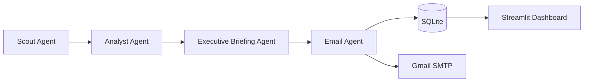

# AI Intelligence Observatory

Daily **Executive AI Intelligence Brief** for technology leaders, TPMs, AI transformation leaders, PMOs, and CIOs — powered by **CrewAI**, **NewsAPI**, and **RSS feeds**.

## Architecture



| Agent | Responsibility |
|-------|----------------|
| **Scout** | Collect AI news from NewsAPI + RSS (OpenAI, Anthropic, DeepMind, Meta, Microsoft, NVIDIA, Reuters, TechCrunch) |
| **Analyst** | Deduplicate, score relevance (1–10), keep top 10, explain why each story matters |
| **Executive Briefing** | Top stories, enterprise impact, emerging themes, recommended actions |
| **Email** | HTML email generation and Gmail SMTP delivery |

## Quick Start

### 1. Install

```bash
cd "AI Intelligence Observatory"
python -m venv .venv
.venv\Scripts\activate        # Windows
pip install -e ".[dev]"
```

### 2. Configure

```bash
copy .env.example .env
```

Edit `.env` with your keys:

- `OPENAI_API_KEY` — for CrewAI agents
- `NEWSAPI_KEY` — from [newsapi.org](https://newsapi.org)
- `SMTP_USER` / `SMTP_PASSWORD` — Gmail App Password recommended
- `EMAIL_RECIPIENTS` — comma-separated list

Set `USE_LLM=false` to run the MVP in **deterministic mode** (no OpenAI calls) for local testing.

### 3. Initialize database

```bash
python -m ai_observatory init-db
```

### 4. Generate a briefing

```bash
python -m ai_observatory run
python -m ai_observatory run --email
```

### 5. Start daily scheduler (7:00 AM default)

```bash
python -m ai_observatory schedule
```

### 6. Launch dashboard

```bash
streamlit run dashboard/app.py
```

## Project Structure

```
AI Intelligence Observatory/
├── src/ai_observatory/
│   ├── collectors/       # NewsAPI + RSS collection
│   ├── analysis.py       # Scoring, themes, actions (deterministic fallback)
│   ├── crew.py           # CrewAI agents & pipeline
│   ├── database.py       # SQLite persistence
│   ├── email_service.py  # HTML email + Gmail SMTP
│   ├── scheduler.py      # APScheduler daily job
│   └── config.py         # Environment configuration
├── dashboard/app.py      # Streamlit review & trend analysis
├── tests/                # Unit tests
└── data/                 # SQLite DB (created at runtime)
```

## Features

- **Multi-source collection**: NewsAPI + 8 curated RSS feeds
- **CrewAI agent pipeline**: Scout → Analyst → Executive → Email
- **Deterministic fallback**: Works without LLM for dev/test (`USE_LLM=false`)
- **SQLite persistence**: Daily briefings stored for historical review
- **Configurable recipients**: `EMAIL_RECIPIENTS` in `.env`
- **Structured JSON logging**: stdout logs for observability
- **Streamlit dashboard**: Review briefings, preview HTML email, trend charts
- **Unit tests**: Collector, analysis, email, database coverage

## Testing

```bash
pytest -v
```

## MVP Notes (2-day scope)

This MVP prioritizes a working end-to-end pipeline:

1. Collect → analyze → brief → store → (optionally) email
2. Dashboard for review and basic trend analysis
3. Scheduler for daily morning delivery

**Production hardening** (post-MVP): retry logic for feeds, secret management, Docker deployment, auth on dashboard, and richer LLM output validation.

## License

MIT
